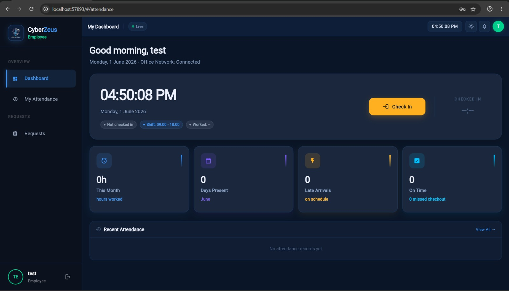
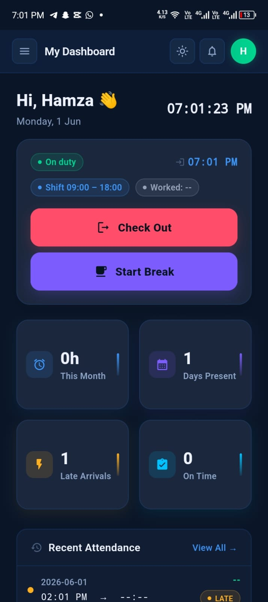
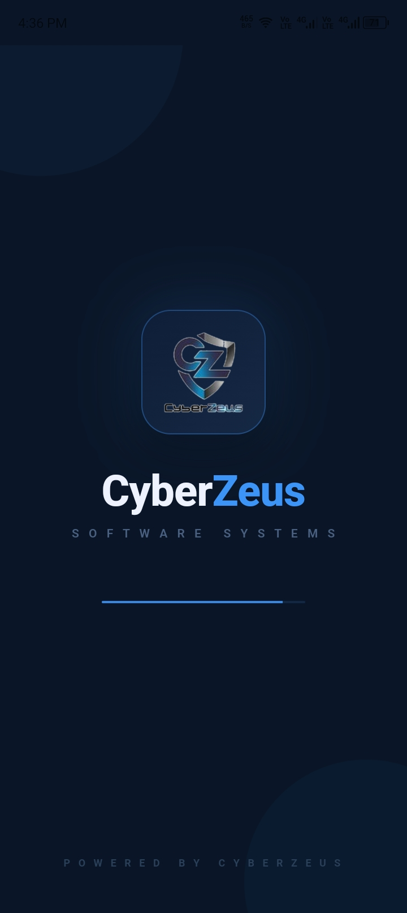
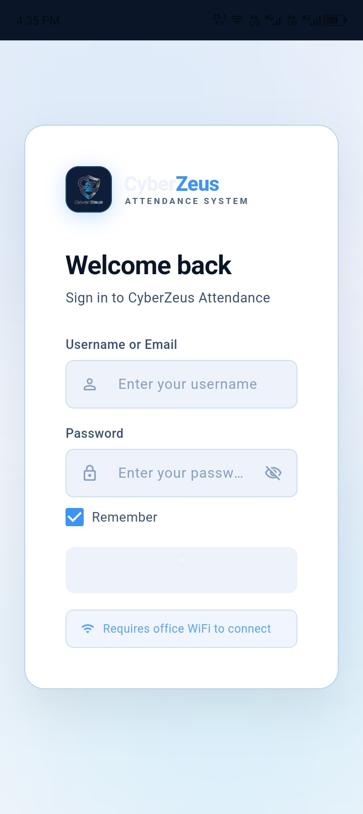
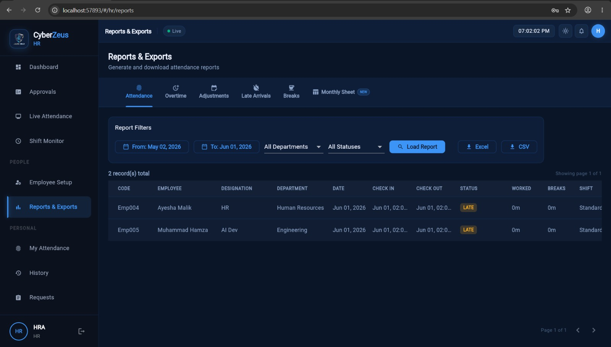
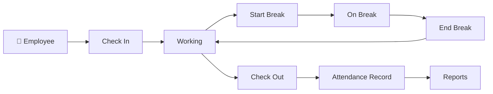
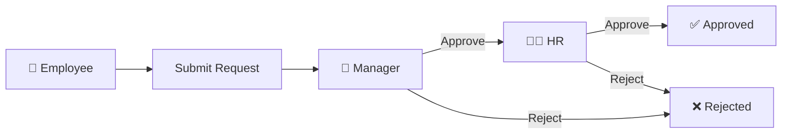

<div align="center">

# 🕒 Attendance Management System

### Flutter + Node.js / TypeScript Full-Stack Workforce Platform


<p>
A modern, responsive <strong>employee attendance and workforce management system</strong>
built with <strong>Flutter</strong> for Android, Web and Windows experiences
and a <strong>Node.js + TypeScript REST API</strong> backend.
</p>

<br>


<br>


<br>

### `Attendance` • `Employees` • `Managers` • `HR` • `Reports` • `Flutter` • `Node.js`

</div>

---

# ✨ Product Preview

## 💻 Desktop / Web Employee Dashboard

<div align="center">



</div>

<br>

## 📱 Mobile Employee Experience

<div align="center">



</div>

<br>

<div align="center">

### One attendance platform — optimized for mobile, web and desktop.

</div>

---

# 🌟 Overview

The **Attendance Management System** is a full-stack workforce-management platform designed to simplify and centralize:

* Employee attendance
* Clock-in / clock-out
* Break tracking
* Working hours
* Shift management
* Attendance corrections
* Overtime requests
* Manager approvals
* HR monitoring
* Employee management
* Administrative configuration
* Attendance reporting
* CSV / Excel exports

The application combines a responsive **Flutter frontend** with a modular **Node.js + Express + TypeScript backend**.

```text
                    Attendance Platform
                           │
             ┌─────────────┴─────────────┐
             │                           │
             ▼                           ▼
       📱 Flutter Mobile           💻 Flutter Web
             │                           │
             └─────────────┬─────────────┘
                           │
                           ▼
                 🔌 REST API Backend
                           │
                           ▼
              Node.js + TypeScript
                           │
          ┌────────────────┼────────────────┐
          │                │                │
          ▼                ▼                ▼
    Authentication     Attendance      Reporting
          │                │                │
          └────────────────┼────────────────┘
                           │
                           ▼
                       Database
```

---

# 🚀 Core Features

<table>
<tr>
<td width="50%">

## ⏱️ Attendance Tracking

Employees can:

* Check in
* Check out
* Start breaks
* End breaks
* View current attendance status
* Review working hours
* View attendance history

Attendance timestamps are processed by the backend rather than relying only on client-device time.

</td>

<td width="50%">

## 👥 Role-Based Access

The system supports multiple organizational roles:

* Employee
* Manager
* HR
* Administrator

Each role receives dedicated navigation, functionality and permissions.

</td>
</tr>

<tr>
<td>

## 📋 Request Management

Employees can submit:

* Attendance corrections
* Overtime requests
* Missing-time adjustments
* Time correction requests

Requests can then move through an approval process.

</td>

<td>

## 📊 Reporting

HR and administrative users can access:

* Attendance reports
* Overtime
* Adjustments
* Late arrivals
* Break reports
* Monthly sheets
* CSV exports
* Excel exports

</td>
</tr>

<tr>
<td>

## 🕒 Shift Management

Organizations can configure:

* Working shifts
* Shift start/end times
* Grace periods
* Departments
* Attendance policies

</td>

<td>

## 🔐 Authentication & Security

The backend architecture includes:

* JWT authentication
* Protected API routes
* Authentication middleware
* Rate limiting
* Error handling
* Role-based permissions
* Audit-oriented architecture

</td>
</tr>
</table>

---

# 📱 Mobile Experience

The Flutter Android interface focuses on fast employee attendance actions.

<table>
<tr>
<td align="center">



### Application Startup

</td>

<td align="center">



### Secure Login

</td>

<td align="center">


### Employee Dashboard

</td>

</tr>
</table>

### Mobile functionality

```text
Login
  │
  ▼
Employee Dashboard
  │
  ├── Current Status
  ├── Assigned Shift
  ├── Clock In / Out
  ├── Start / End Break
  ├── Monthly Hours
  ├── Days Present
  ├── Late Arrivals
  ├── On-Time Records
  └── Recent Attendance
```

The interface is optimized for daily employee use where attendance actions need to be quick and obvious.

---

# 💻 Desktop / Web Experience

The desktop experience provides more screen space for workforce statistics, records and administrative workflows.

<div align="center">


</div>

The desktop employee dashboard surfaces:

| Information          | Purpose                        |
| -------------------- | ------------------------------ |
| 🕒 Current Time      | Live attendance context        |
| 🟢 Attendance Status | Checked-in / checked-out state |
| 📅 Assigned Shift    | Employee shift schedule        |
| ⏱️ Worked Hours      | Current / monthly working time |
| 📆 Days Present      | Monthly attendance count       |
| ⚡ Late Arrivals      | Attendance exceptions          |
| ✅ On-Time            | Punctuality indicator          |
| 📋 Recent Attendance | Recent employee records        |

---

# 📊 HR Reports & Exports

<div align="center">



</div>

The HR interface provides a centralized reporting workspace.

### Available report categories

```text
Reports & Exports
│
├── Attendance
├── Overtime
├── Adjustments
├── Late Arrivals
├── Breaks
└── Monthly Sheet
```

### Report filters

HR users can filter records by:

* Date range
* Department
* Attendance status
* Report category

and export results to:

```text
Excel
CSV
```

---

# 👤 Employee Role

The employee experience focuses on personal attendance.

### Features

* ✅ Clock in
* ✅ Clock out
* ✅ Start break
* ✅ End break
* ✅ Current attendance status
* ✅ Shift information
* ✅ Worked-hour statistics
* ✅ Attendance history
* ✅ Late-arrival tracking
* ✅ Request submission

---

# 👔 Manager Role

Managers receive team-level functionality.

### Features

* Team attendance monitoring
* Employee status visibility
* Team request review
* Approve requests
* Reject requests
* Attendance exception monitoring

---

# 🧑‍💼 HR Role

HR receives organization-level attendance management.

### Features

* Live attendance
* Shift monitoring
* Employee setup
* Employee directory
* Attendance reporting
* Overtime reports
* Adjustment reports
* Break analysis
* Late-arrival monitoring
* Monthly attendance sheets
* CSV export
* Excel export
* Approval workflows

---

# ⚙️ Administrator Role

Administrators manage the configuration and security of the system.

### Features

* User accounts
* Employee accounts
* Departments
* Shifts
* Attendance settings
* Grace-period configuration
* Organization settings
* Network settings
* Audit logs
* API/system health monitoring

---

# 🏗️ Backend Architecture

The backend follows a modular service-oriented structure.

```text
HTTP Request
      │
      ▼
    Routes
      │
      ▼
 Controllers
      │
      ▼
  Services
      │
      ▼
Repositories
      │
      ▼
   Database
```

Cross-cutting concerns are handled through middleware and configuration modules.

```text
                Express Application
                       │
        ┌──────────────┼──────────────┐
        │              │              │
        ▼              ▼              ▼
      Routes       Middleware       Config
        │
        ▼
    Controllers
        │
        ▼
     Services
        │
        ▼
   Repositories
        │
        ▼
     Database
```

---

# 📁 Actual Repository Structure

The project currently follows this structure:

```text
Attendance_System/
│
├── backend/
│   │
│   ├── src/
│   │   │
│   │   ├── config/
│   │   │   └── Backend configuration
│   │   │
│   │   ├── controllers/
│   │   │   └── HTTP request handlers
│   │   │
│   │   ├── middleware/
│   │   │   ├── Authentication
│   │   │   ├── Authorization
│   │   │   ├── Rate limiting
│   │   │   └── Error handling
│   │   │
│   │   ├── repositories/
│   │   │   └── Data-access layer
│   │   │
│   │   ├── routes/
│   │   │   └── Express routers
│   │   │
│   │   ├── services/
│   │   │   └── Business logic
│   │   │
│   │   ├── utils/
│   │   │   └── Shared backend utilities
│   │   │
│   │   ├── app.ts
│   │   └── server.ts
│   │
│   ├── .env.example
│   ├── .nvmrc
│   ├── package-lock.json
│   ├── package.json
│   └── tsconfig.json
│
├── config/
│   └── Project / deployment configuration
│
├── database/
│   └── Database-related files
│
├── docs/
│   │
│   ├── architecture_note.md
│   ├── cyberzeus_app_preview.html
│   ├── cyberzeus_logo_transparent.png
│   └── additional project branding / documentation
│
├── frontend/
│   │
│   ├── android/
│   │   └── Flutter Android platform
│   │
│   ├── assets/
│   │   └── images/
│   │       ├── ams1.jpeg
│   │       ├── ams2.jpeg
│   │       ├── ams3.jpeg
│   │       ├── ams4.jpeg
│   │       └── ams5.jpeg
│   │
│   ├── lib/
│   │   └── Flutter / Dart application source
│   │
│   ├── test/
│   │   └── Flutter tests
│   │
│   ├── web/
│   │   └── Flutter Web platform
│   │
│   ├── windows/
│   │   └── Flutter Windows platform
│   │
│   ├── .gitignore
│   ├── .metadata
│   ├── README.md
│   ├── analysis_options.yaml
│   ├── build_apk.ps1
│   ├── pubspec.lock
│   └── pubspec.yaml
│
└── README.md
```

> Some filenames inside `docs/` may contain additional branding assets not fully shown above. The tree reflects the structure visible in the current repository.

---

# 🛠️ Technology Stack

## 🎨 Frontend

| Technology             | Purpose                           |
| ---------------------- | --------------------------------- |
| **Flutter 3.x**        | Cross-platform application        |
| **Dart**               | Frontend programming language     |
| **Riverpod 2.x**       | State management                  |
| **GoRouter 12.x**      | Application routing               |
| **Material 3**         | UI system                         |
| **Responsive Layouts** | Mobile / Web / Windows experience |

---

## ⚙️ Backend

| Technology     | Purpose                                 |
| -------------- | --------------------------------------- |
| **Node.js 20** | Backend runtime                         |
| **TypeScript** | Type-safe server development            |
| **Express.js** | REST API framework                      |
| **JWT**        | Authentication                          |
| **SQLite**     | Application database                    |
| **Middleware** | Auth, validation, rate limiting, errors |

---

# 🔄 Attendance Lifecycle



---

# 📋 Request & Approval Workflow



Requests may include:

* Attendance correction
* Missing clock-in
* Missing clock-out
* Overtime
* Time adjustment

---

# 🌐 Runtime Server Configuration

The application allows the API/server address to be configured at runtime.

This is especially useful for office deployments because the same APK can connect to different servers without recompilation.

| Environment         | Example                          |
| ------------------- | -------------------------------- |
| 🏢 Office LAN       | `http://192.168.100.15:5000`     |
| 🌍 Remote Server    | `https://attendance.example.com` |
| 🤖 Android Emulator | `http://10.0.2.2:5000`           |
| 💻 Localhost        | `http://127.0.0.1:5000`          |

For internet-facing deployments, **HTTPS is strongly recommended**.

---

# 🏢 Office Network Deployment

The application's office-network model can look like:

```text
                        OFFICE NETWORK
                              │
          ┌───────────────────┼───────────────────┐
          │                   │                   │
          ▼                   ▼                   ▼
    Employee Phones      Manager Devices       HR PCs
          │                   │                   │
          └───────────────────┼───────────────────┘
                              │
                              ▼
                         Office Wi-Fi
                              │
                              ▼
                   Node.js Attendance API
                              │
                              ▼
                         SQLite Database
```

---

# 🔐 Authentication

Authentication is based on JWT access and refresh tokens.

```text
Credentials
    │
    ▼
Login Endpoint
    │
    ▼
Authentication Service
    │
    ├── Access Token
    │
    └── Refresh Token
```

Protected API requests use:

```http
Authorization: Bearer <ACCESS_TOKEN>
```

---

# 🔒 Security Architecture

The application is structured around:

```text
JWT Authentication
       +
Role Authorization
       +
Server-Side Timestamps
       +
Rate Limiting
       +
Environment Secrets
       +
Error Handling
       +
Audit Logs
       +
Optional Network Restriction
```

For production deployment, additionally use:

* HTTPS
* Strong secrets
* Secure password hashing
* Reverse proxy
* Firewall rules
* Automated backups
* Secret rotation
* Dependency updates
* Centralized logging
* Monitoring
* Account lockout / throttling where appropriate

---

# 🚀 Getting Started

## Requirements

| Tool           | Version               |
| -------------- | --------------------- |
| Node.js        | 20.x                  |
| npm            | 10.x                  |
| Flutter        | 3.x                   |
| Dart           | Included with Flutter |
| Java JDK       | 17                    |
| Android Studio | Latest stable         |
| Git            | Current               |

---

# 1️⃣ Clone Repository

```bash
git clone https://github.com/Hamza-code-hub/Attendance-Management-System-Flutter-NodeJS.git

cd Attendance-Management-System-Flutter-NodeJS
```

If your repository still has another GitHub name, use its current clone URL.

---

# 2️⃣ Backend Setup

```bash
cd backend
```

Install dependencies:

```bash
npm install
```

Create the environment file.

### Linux / macOS

```bash
cp .env.example .env
```

### Windows PowerShell

```powershell
Copy-Item .env.example .env
```

Update `.env` with secure values.

Start development mode:

```bash
npm run dev
```

Default API:

```text
http://localhost:5000
```

---

# 🏭 Backend Production

Compile TypeScript:

```bash
npm run build
```

Start production:

```bash
npm start
```

```text
TypeScript Source
       │
       ▼
 npm run build
       │
       ▼
      dist/
       │
       ▼
Node.js Production Server
```

---

# 3️⃣ Flutter Setup

```bash
cd frontend
```

Install packages:

```bash
flutter pub get
```

Check Flutter:

```bash
flutter doctor
```

Check available devices:

```bash
flutter devices
```

---

# 🌐 Run Web Version

```bash
flutter run -d chrome
```

Production web build:

```bash
flutter build web --release
```

---

# 🪟 Run Windows Version

```bash
flutter run -d windows
```

Production build:

```bash
flutter build windows --release
```

---

# 📱 Run Android Version

```bash
flutter run
```

Build release APK:

```bash
flutter clean
flutter pub get
flutter build apk --release
```

Output:

```text
frontend/build/app/outputs/flutter-apk/app-release.apk
```

The repository also contains:

```text
frontend/build_apk.ps1
```

which can be used for the project's Windows-based APK build workflow if configured accordingly.

---

# 🔑 Android Signing

Production APKs should use a private signing key.

Never commit:

```text
*.jks
*.keystore
key.properties
```

Recommended `.gitignore`:

```gitignore
android/key.properties
android/app/*.jks
android/app/*.keystore
```

---

# 📊 Reporting System

The reporting workspace supports multiple workforce report types:

```text
                   Reports
                      │
       ┌──────────────┼──────────────┐
       │              │              │
       ▼              ▼              ▼
  Attendance       Overtime     Adjustments
       │              │              │
       ├──────────────┼──────────────┤
       │              │              │
       ▼              ▼              ▼
 Late Arrivals      Breaks       Monthly Sheet
                      │
                      ▼
                 Export Data
                  ┌───┴───┐
                  ▼       ▼
                Excel     CSV
```

---

# ❤️ API Health

The backend can expose:

```http
GET /api/health
```

for deployment and monitoring checks.

---

# 👤 Initial Administrator

If the current development database seeder creates:

```text
Username : admin
Password : admin123
```

change the password immediately after initial setup.

For a production system, replace permanent default credentials with a secure first-run account-creation process.

---

# 🧪 Development Commands

## Backend

```bash
npm run dev
```

```bash
npm run build
```

```bash
npm start
```

---

## Flutter

Analyze:

```bash
flutter analyze
```

Test:

```bash
flutter test
```

Format:

```bash
dart format .
```

Dependencies:

```bash
flutter pub get
```

Check packages:

```bash
flutter pub outdated
```

---

# 🗺️ Roadmap

## ✅ Attendance

* [x] Employee authentication
* [x] Clock in
* [x] Clock out
* [x] Break tracking
* [x] Shift display
* [x] Attendance history
* [x] Server-managed timestamps
* [x] Mobile employee dashboard
* [x] Desktop employee dashboard

## ✅ Workforce Management

* [x] Employee accounts
* [x] Role-based interfaces
* [x] Manager workflows
* [x] HR interface
* [x] Employee setup
* [x] Department support
* [x] Shift management
* [x] Request workflows

## ✅ Reporting

* [x] Attendance reports
* [x] Overtime reports
* [x] Adjustment reports
* [x] Late-arrival reports
* [x] Break reports
* [x] Monthly sheet
* [x] CSV export
* [x] Excel export

## 🚀 Future Development

* [ ] QR attendance
* [ ] NFC attendance
* [ ] Biometric-device integration
* [ ] Face-recognition integration
* [ ] Geofencing
* [ ] GPS field attendance
* [ ] Push notifications
* [ ] Email notifications
* [ ] Leave management
* [ ] Payroll integration
* [ ] PostgreSQL
* [ ] Docker deployment
* [ ] CI/CD
* [ ] Offline synchronization
* [ ] Multi-organization support
* [ ] Advanced workforce analytics

---

# 🎯 Use Cases

| Environment           | Application               |
| --------------------- | ------------------------- |
| 🏢 Offices            | Daily employee attendance |
| 💻 Software Companies | Working-hour tracking     |
| 🏭 Factories          | Shift attendance          |
| 🏫 Institutions       | Staff attendance          |
| 🏥 Organizations      | Administrative workforce  |
| 🏪 Retail             | Shift management          |
| 🏗️ Field Teams       | Attendance workflows      |

---

# ⚠️ Production Considerations

SQLite is well suited to:

```text
Development
Small Deployments
Internal Demonstrations
Lightweight Office Systems
```

For larger deployments, consider:

```text
PostgreSQL
     +
Reverse Proxy
     +
HTTPS
     +
Automated Backups
     +
Process Management
     +
Monitoring
     +
Centralized Logging
     +
Docker
```

---

# 📜 License

Choose the license according to how the repository will be distributed.

### Open Source

Possible options:

* MIT
* Apache-2.0
* GPL-3.0

### Organization / Internal Deployment

```text
Private / Proprietary
```

Avoid using company-specific copyright or licensing language if this repository is intended to be a reusable general attendance-management project.

---

# 🤝 Contributing

Contributions are welcome in:

* Flutter
* Dart
* Node.js
* TypeScript
* REST APIs
* Attendance workflows
* Reporting
* UI / UX
* Authentication
* Testing
* Databases
* Deployment

```bash
git checkout -b feature/improvement

git add .

git commit -m "feat: add attendance improvement"

git push origin feature/improvement
```

Then open a pull request.

---

<div align="center">

# 🕒 Attendance Management System

## Flutter × Node.js × TypeScript × Workforce Automation

### One Platform for Employees, Managers, HR & Administration

<br>


<br>

### 📱 Mobile • 💻 Web • 🪟 Windows • 🔐 Secure • 📊 Report-Driven

<br>

**A modern full-stack foundation for attendance, workforce visibility and organizational time management.**

</div>
