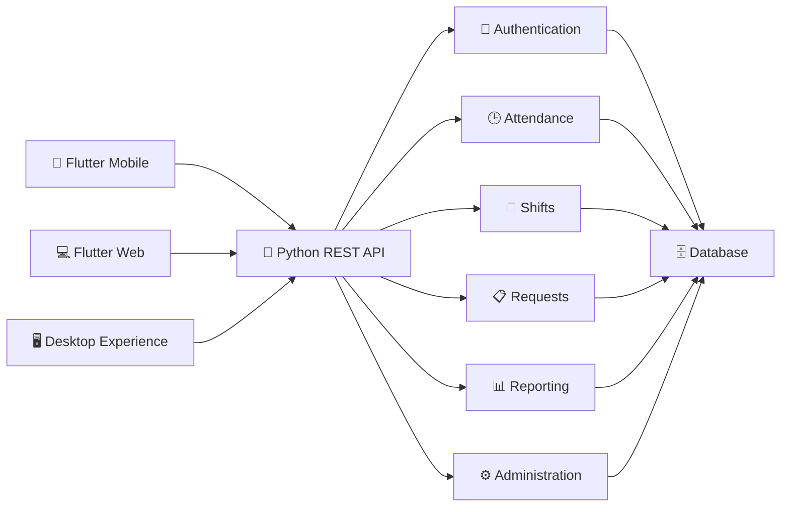
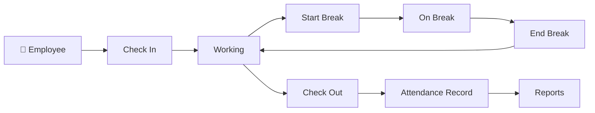
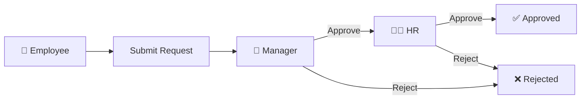

<div align="center">

# 🕒 Attendance Management System

### Flutter + Python Full-Stack Workforce & Attendance Platform

<p>
A modern, responsive <strong>employee attendance and workforce management system</strong>
built for <strong>mobile, web and desktop experiences</strong> using
<strong>Flutter</strong> with a <strong>Python REST API backend</strong>.
</p>

<br>


<br>


<br>

### `Attendance` • `Employees` • `Managers` • `HR` • `Reports` • `Flutter` • `Python`

</div>

---

## ✨ Product Preview

<table>
<tr>
<td width="40%" align="center">

### 📱 Employee Mobile


</td>

<td width="60%" align="center">

### 💻 Employee Web / Desktop


</td>
</tr>
</table>

<div align="center">

**One attendance platform. Multiple roles. Multiple devices.**

</div>

---

# 🌟 Overview

The **Attendance Management System** is a full-stack workforce platform designed to centralize employee attendance, shift monitoring, working hours, break tracking, request approvals and HR reporting.

The application provides a responsive Flutter interface that adapts the same business workflow to different environments:

```text
                    Attendance Platform
                           │
              ┌────────────┴────────────┐
              │                         │
              ▼                         ▼
        📱 Mobile App             💻 Web / Desktop
              │                         │
              └────────────┬────────────┘
                           │
                           ▼
                    Python REST API
                           │
           ┌───────────────┼───────────────┐
           │               │               │
           ▼               ▼               ▼
      Authentication   Attendance      HR / Reports
           │               │               │
           └───────────────┼───────────────┘
                           │
                           ▼
                         Database
```

The platform supports complete attendance workflows for:

* 👤 Employees
* 👔 Managers
* 🧑‍💼 HR teams
* ⚙️ Administrators

---

# 🎨 Responsive User Experience

The system was designed as more than a desktop HR dashboard.

It provides separate responsive experiences optimized for both employees and administrative users.

## 📱 Mobile Experience

The mobile application provides employees with fast access to the actions they need throughout the workday.

<table>
<tr>
<td align="center">


**Secure Login**

</td>

<td align="center">


**Application Startup**

</td>

<td align="center">


**Employee Dashboard**

</td>
</tr>
</table>

### Mobile capabilities

* Clock in
* Clock out
* Start / end break
* View live shift information
* Review monthly hours
* Monitor days present
* Track late arrivals
* View attendance history
* Submit attendance requests
* Runtime server configuration

---

# 💻 Desktop & Web Experience

The web/desktop interface gives employees, managers and HR teams a wider operational workspace.

<div align="center">


</div>

The employee dashboard provides immediate visibility into:

```text
Current Time
    +
Attendance Status
    +
Assigned Shift
    +
Worked Hours
    +
Days Present
    +
Late Arrivals
    +
On-Time Attendance
    +
Recent Attendance
```

---

# 📊 HR Reports & Exports

<div align="center">


</div>

The HR reporting interface provides centralized access to multiple attendance datasets.

### Available report categories

* Attendance
* Overtime
* Adjustments
* Late arrivals
* Breaks
* Monthly sheets

### Reporting controls

```text
Date Range
    +
Department
    +
Attendance Status
    +
Report Type
    ↓
Filtered Workforce Data
    ↓
CSV / Excel Export
```

---

# 🚀 Key Features

<table>
<tr>
<td width="50%">

## ⏱️ Attendance Tracking

Employees can:

* Check in
* Check out
* Start breaks
* End breaks
* View live status
* Review attendance history

Attendance timestamps should be validated server-side.

</td>

<td width="50%">

## 👥 Role-Based Access

The platform supports dedicated workflows for:

* Employee
* Manager
* HR
* Administrator

Each role receives the tools relevant to its responsibilities.

</td>
</tr>

<tr>
<td>

## 📋 Request Management

Employees can submit:

* Attendance corrections
* Overtime requests
* Missing-time requests
* Time adjustments

Requests can then move through an approval workflow.

</td>

<td>

## 📊 HR Reporting

HR users can review:

* Employee attendance
* Late arrivals
* Overtime
* Break activity
* Monthly records
* Shift attendance

with export functionality.

</td>
</tr>

<tr>
<td>

## 🕒 Shift Management

Organizations can define:

* Shift schedules
* Start / end times
* Grace periods
* Department assignments
* Attendance policies

</td>

<td>

## 🔐 Authentication

The architecture supports:

* Secure login
* JWT authentication
* Role authorization
* Protected API routes
* Session handling

</td>
</tr>
</table>

---

# 👤 Employee Experience

The employee dashboard is built around one primary question:

> **What is my attendance status right now?**

The interface surfaces the most relevant information immediately.

```text
                EMPLOYEE DASHBOARD
                       │
          ┌────────────┼────────────┐
          │            │            │
          ▼            ▼            ▼
       Status        Shift        Live Time
          │
          ▼
     Check In / Out
          │
          ▼
      Break Control
          │
     ┌────┴───────────────┐
     ▼                    ▼
Statistics          Attendance History
```

### Employee features

* ✅ Real-time attendance status
* ✅ Clock in / clock out
* ✅ Start and end breaks
* ✅ Assigned shift display
* ✅ Hours worked
* ✅ Days present
* ✅ Late-arrival tracking
* ✅ On-time attendance tracking
* ✅ Attendance history
* ✅ Request submission

---

# 👔 Manager Experience

Managers can move beyond personal attendance into team-level operations.

### Manager capabilities

* Team attendance dashboard
* Employee status monitoring
* Pending request review
* Approve requests
* Reject requests
* Monitor team attendance
* Review attendance exceptions

---

# 🧑‍💼 HR Experience

The HR workspace is designed for organization-wide workforce monitoring.

```text
                       HR WORKSPACE
                            │
            ┌───────────────┼───────────────┐
            │               │               │
            ▼               ▼               ▼
     Live Attendance    Shift Monitor    Employees
            │               │               │
            └───────────────┼───────────────┘
                            │
                            ▼
                     Reports & Exports
                            │
          ┌─────────────────┼─────────────────┐
          ▼                 ▼                 ▼
      Attendance        Overtime           Breaks
          │                 │                 │
          └─────────────────┼─────────────────┘
                            ▼
                       CSV / Excel
```

### HR features

* Live attendance monitoring
* Shift monitoring
* Employee directory
* Department-level filtering
* Attendance reports
* Overtime reporting
* Break reporting
* Late-arrival reporting
* Monthly attendance sheets
* Request approvals
* CSV export
* Excel export

---

# ⚙️ Administrator Experience

Administrators manage the core configuration of the platform.

### Administrative capabilities

* User accounts
* Employee accounts
* Departments
* Roles
* Shifts
* Attendance settings
* Grace periods
* Organization configuration
* Server settings
* Audit logs
* System health

---

# 🏗️ Full-Stack Architecture



---

# 🛠️ Technology Stack

## Frontend

| Technology             | Purpose                    |
| ---------------------- | -------------------------- |
| **Flutter**            | Cross-platform application |
| **Dart**               | Application language       |
| **Riverpod**           | State management           |
| **GoRouter**           | Application routing        |
| **Material 3**         | UI foundation              |
| **Responsive Layouts** | Mobile / Web / Desktop UX  |

## Backend

| Technology   | Purpose                          |
| ------------ | -------------------------------- |
| **Python**   | Backend application language     |
| **REST API** | Frontend/backend communication   |
| **JWT**      | Authentication                   |
| **SQLite**   | Local / small deployment storage |

> If the current backend uses FastAPI, Flask or Django, add the exact framework here rather than simply writing “Python”.

---

# 📁 Project Structure

```text
Attendance-Management-System/
│
├── backend/
│   │
│   ├── app/
│   │   ├── api/
│   │   │   └── API routes
│   │   │
│   │   ├── core/
│   │   │   ├── configuration
│   │   │   ├── authentication
│   │   │   └── security
│   │   │
│   │   ├── models/
│   │   │   └── database models
│   │   │
│   │   ├── schemas/
│   │   │   └── request / response models
│   │   │
│   │   ├── services/
│   │   │   └── business logic
│   │   │
│   │   ├── repositories/
│   │   │   └── data-access layer
│   │   │
│   │   └── main.py
│   │
│   ├── requirements.txt
│   └── .env.example
│
├── frontend/
│   │
│   ├── lib/
│   │   ├── core/
│   │   │   ├── config/
│   │   │   ├── network/
│   │   │   ├── router/
│   │   │   ├── theme/
│   │   │   └── utils/
│   │   │
│   │   ├── features/
│   │   │   ├── authentication/
│   │   │   ├── attendance/
│   │   │   ├── dashboard/
│   │   │   ├── employees/
│   │   │   ├── requests/
│   │   │   ├── reports/
│   │   │   ├── shifts/
│   │   │   └── administration/
│   │   │
│   │   └── main.dart
│   │
│   ├── assets/
│   ├── android/
│   ├── web/
│   └── pubspec.yaml
│
├── assets/
│   └── readme/
│       ├── login-mobile.jpeg
│       ├── splash-mobile.jpeg
│       ├── employee-mobile.jpeg
│       ├── employee-desktop.jpeg
│       └── reports-desktop.jpeg
│
├── README.md
└── .gitignore
```

---

# 🔄 Attendance Lifecycle



The backend should remain the authoritative source for attendance timestamps.

---

# 📋 Request & Approval Flow



Typical requests include:

* Missing clock-in
* Missing clock-out
* Attendance correction
* Overtime
* Time adjustment

---

# 🌐 Dynamic Server Configuration

The mobile application can support runtime API configuration so the same build can connect to different deployments.

| Environment          | Example API                      |
| -------------------- | -------------------------------- |
| 🏢 Office LAN        | `http://192.168.100.15:5000`     |
| 🌍 Remote Server     | `https://attendance.example.com` |
| 🤖 Android Emulator  | `http://10.0.2.2:5000`           |
| 💻 Local Development | `http://127.0.0.1:5000`          |

This eliminates the need to rebuild the Flutter application each time the backend address changes.

---

# 🏢 Office Deployment

A typical deployment can look like:

```text
                       OFFICE NETWORK
                              │
            ┌─────────────────┼─────────────────┐
            │                 │                 │
            ▼                 ▼                 ▼
      Employee Phones    Manager Devices     HR PCs
            │                 │                 │
            └─────────────────┼─────────────────┘
                              │
                              ▼
                         Office Wi-Fi
                              │
                              ▼
                      Python API Server
                              │
                              ▼
                          Database
```

---

# 🚀 Getting Started

## Requirements

### Backend

```text
Python 3.10+
pip
```

### Frontend

```text
Flutter 3.x
Dart
Android Studio / VS Code
```

### General

```text
Git
```

---

## 1️⃣ Clone

```bash
git clone https://github.com/Hamza-code-hub/Attendance-Management-System-Flutter-Python.git

cd Attendance-Management-System-Flutter-Python
```

---

# 🐍 Backend Setup

Enter the backend:

```bash
cd backend
```

Create a virtual environment.

### Windows

```bash
python -m venv .venv

.venv\Scripts\activate
```

### Linux / macOS

```bash
python3 -m venv .venv

source .venv/bin/activate
```

Install dependencies:

```bash
pip install -r requirements.txt
```

Create environment configuration:

```text
.env
```

from:

```text
.env.example
```

Then start the API using the command appropriate for the framework used by the backend.

For example, with FastAPI:

```bash
uvicorn app.main:app --reload --port 5000
```

> Use the actual backend command from your project if it differs.

---

# 📱 Flutter Setup

Open another terminal:

```bash
cd frontend
```

Install packages:

```bash
flutter pub get
```

Check the environment:

```bash
flutter doctor
```

View available devices:

```bash
flutter devices
```

---

# 🌐 Run Web Application

```bash
flutter run -d chrome
```

Build:

```bash
flutter build web --release
```

---

# 📱 Run Android Application

```bash
flutter run
```

Release APK:

```bash
flutter clean

flutter pub get

flutter build apk --release
```

Expected output:

```text
frontend/build/app/outputs/flutter-apk/app-release.apk
```

---

# 🔐 Security Architecture

The platform should follow a layered security approach:

```text
Authentication
      +
Role Authorization
      +
JWT Validation
      +
Server-Side Timestamps
      +
Rate Limiting
      +
Input Validation
      +
Environment Secrets
      +
Audit Logging
      +
HTTPS
```

For production deployments:

* Never hard-code secrets
* Never commit `.env`
* Never commit Android signing passwords
* Use HTTPS
* Use strong password hashing
* Rotate secrets where appropriate
* Enable request validation
* Restrict administrative APIs
* Monitor authentication events
* Maintain audit records

---

# 🔑 Android Signing

Never commit:

```text
*.jks
*.keystore
key.properties
```

Recommended `.gitignore` entries:

```gitignore
android/key.properties
android/app/*.jks
android/app/*.keystore
```

Generate a signing key only for your own production application identity.

---

# 📈 Dashboard Intelligence

The platform already demonstrates useful workforce metrics such as:

```text
Total Hours Worked

Days Present

Late Arrivals

On-Time Arrivals

Current Shift

Current Attendance Status

Recent Attendance
```

Future HR dashboards could additionally include:

```text
Attendance Rate

Absence Rate

Average Arrival Time

Monthly Overtime

Department Performance

Shift Compliance

Attendance Trends

Pending Requests
```

---

# 🗺️ Roadmap

## ✅ Attendance Core

* [x] Employee authentication
* [x] Check in
* [x] Check out
* [x] Break tracking
* [x] Shift display
* [x] Attendance history
* [x] Employee dashboard
* [x] Mobile responsive interface
* [x] Desktop responsive interface

## ✅ Management

* [x] Role-based dashboards
* [x] Manager workflow
* [x] HR interface
* [x] Employee management
* [x] Request workflow

## ✅ Reporting

* [x] Attendance reports
* [x] Overtime reports
* [x] Adjustment reports
* [x] Late-arrival reports
* [x] Break reports
* [x] Monthly reporting
* [x] CSV export
* [x] Excel export

## 🚀 Future

* [ ] QR attendance
* [ ] NFC attendance
* [ ] Biometric device integration
* [ ] Face recognition
* [ ] Geofencing
* [ ] GPS field attendance
* [ ] Push notifications
* [ ] Email notifications
* [ ] Leave management
* [ ] Payroll integration
* [ ] PostgreSQL
* [ ] Docker deployment
* [ ] CI/CD
* [ ] Multi-organization support
* [ ] Offline synchronization
* [ ] Advanced workforce analytics

---

# 🎯 Potential Use Cases

| Environment           | Use Case                          |
| --------------------- | --------------------------------- |
| 🏢 Offices            | Employee attendance               |
| 💻 Software Companies | Team work-hour tracking           |
| 🏭 Factories          | Shift attendance                  |
| 🏫 Institutions       | Staff attendance                  |
| 🏥 Organizations      | Administrative workforce tracking |
| 🏪 Retail             | Shift management                  |
| 🏗️ Field Teams       | Remote attendance workflows       |

---

# ⚠️ Production Considerations

SQLite is useful for:

* Development
* Demonstrations
* Small office deployments

For larger deployments, consider:

```text
PostgreSQL
     +
Reverse Proxy
     +
HTTPS
     +
Automated Backups
     +
Monitoring
     +
Centralized Logging
     +
Container Deployment
```

---

# 🤝 Contributing

Contributions are welcome in:

* Flutter
* Python
* Backend APIs
* Attendance workflows
* Reporting
* UI / UX
* Database design
* Authentication
* Testing
* Deployment
* HR functionality

Example:

```bash
git checkout -b feature/improvement

git add .

git commit -m "feat: add attendance improvement"

git push origin feature/improvement
```

---

# 📜 License

Choose a license according to how you intend to distribute the application.

Possible open-source licenses:

```text
MIT
Apache-2.0
GPL-3.0
```

For organization-specific deployments:

```text
Private / Proprietary
```

---

<div align="center">

# 🕒 Attendance Management System

## Flutter × Python × Workforce Automation

### One Platform for Employees, Managers, HR & Administration

<br>


<br>

### 📱 Responsive • 🔐 Secure • 🕒 Real-Time • 📊 Report-Driven

<br>

**A modern full-stack foundation for attendance, workforce visibility and organizational time management.**

</div>
