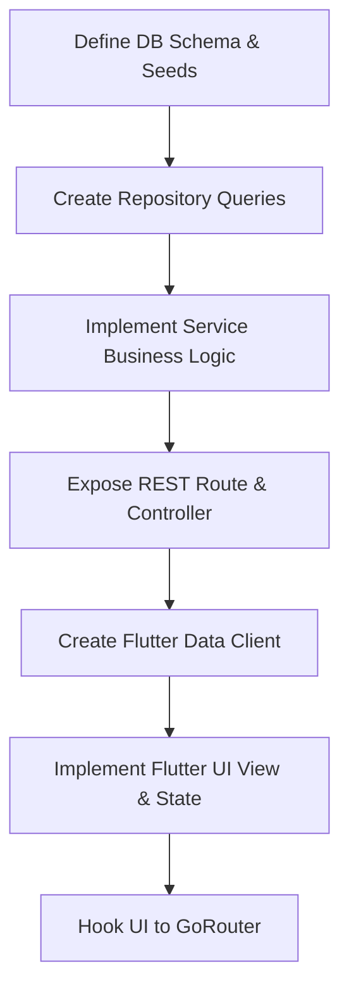

# Architectural Design Decisions: Attendance Management System

This document outlines the architectural patterns and technical design principles applied to the initial project foundation of the Attendance Management System.

---

## 1. Why This Structure Was Chosen

A **Clean, Layered Architecture** was chosen to establish separation of concerns between the user interface, business rules, and data layers. This provides the following critical benefits for an office-scale local intranet app:

1. **Decoupled Components**: The frontend (Flutter Web) and backend (REST API in Node.js/TypeScript) communicate exclusively over clean JSON interfaces. This permits team isolation and allows rewriting either layer without impacting the other.
2. **Modular Domain Layout**: Folders in both the frontend (`lib/features/`) and backend (`src/routes/` and future domain subfolders) are reserved per system module. Developers working on `breaks` or `overtime` can find all associated presentation structures or API controllers in a single, focused area.
3. **Database Transparency**: In place of heavy ORM locking, migrations use raw, highly optimized, and readable PostgreSQL scripts. This matches the simplicity and high performance required for on-premise execution (runs easily on a standard office server or desktop PC).
4. **Intranet Isolation**: Network filters (`verifyOfficeSubnet` middleware) block public WAN connections. Since the application handles confidential employee check-in and location timestamps, ensuring operations stay within the office subnet is critical.

---

## 2. Layer Definitions

### Backend Layers
* **Controller Layer (`src/controllers/`)**: Handles incoming HTTP requests, extracts parameters/headers, handles cookies/JWT sessions, and outputs structured, standard JSON payloads. It contains absolutely zero business rules or SQL statements.
* **Service Layer (`src/services/`)**: Represents the pure business engine. This is where shift schedules are evaluated, grace periods are applied, and check-in boundaries are calculated.
* **Repository Layer (`src/repositories/`)**: Abstracts database interactions. Hand-crafted SQL statements query the pool and return standard TypeScript interfaces.

### Frontend Layers
* **Presentation (`lib/features/.../presentation/`)**: Responsive Material 3 views and widgets configured to render elegantly on full screens or tablets.
* **Domain (`lib/features/.../domain/`)**: Holds entities and interfaces, defining what a "Shift" or "OvertimeRequest" looks like without dependency on network libraries.
* **Data (`lib/features/.../data/`)**: Adapters and network clients (like `http`) to pull details from the backend endpoints.

---

## 3. How Future Modules Will Be Added

Adding a new module (e.g. `breaks` or `shifts`) follows a clear, repeatable recipe:

### Steps to Add the `shifts` Module:
1. **Database Layer**: Add a table migration in `database/migrations/` and initial standard shifts in `database/seeds/`.
2. **Backend Code**:
   - Create `/backend/src/repositories/shift_repository.ts` for database CRUD.
   - Create `/backend/src/services/shift_service.ts` for business logic (validating overlapping shifts).
   - Create `/backend/src/controllers/shift_controller.ts` to map incoming requests.
   - Register route endpoints in `/backend/src/routes/index.ts`.
3. **Frontend Code**:
   - Inside `/frontend/lib/features/shifts/`, implement the model entity, api client, and standard viewing views.
   - Swap the router placeholder in `/frontend/lib/core/navigation/router.dart` from `ModulePlaceholderScreen` to the newly designed Shift Dashboard view.

---

## 4. How Approvals & Reports Fit in Later

### HR Approvals Workflow
1. **Storage**: Handled by `overtime_requests` and `adjustment_requests` tables, which store the record reference, applicant details, status state (`PENDING`, `APPROVED`, `REJECTED`), and administrative audit identifiers (`approved_by`, `approved_at`, `rejection_reason`).
2. **State Transition**:
   - An employee submits an adjustment or overtime request via their client, writing a `PENDING` record in the database.
   - An HR manager reviews pending requests on their dashboard, triggering `/api/approvals/overtime/:id` or `/api/approvals/adjustment/:id` endpoints with the decision.
   - The service layer transitions the record state, automatically correcting the primary `attendance_records` if the adjustment was approved, and records the event in the audit logs.

### Excel Reports Generation
1. **Aggregation**: The `reports` module fetches raw employee attendance logs, shifts grace thresholds, break durations, and overtime metrics across a given date range.
2. **Processing**: We will use standard node packages like `exceljs` or `xlsx` on the backend. This avoids heavy computation on the browser.
3. **Delivery**:
   - The frontend calls `/api/reports/export?start_date=X&end_date=Y`.
   - The backend streams the formatted binary Excel spreadsheet directly as an attachment with content type `application/vnd.openxmlformats-officedocument.spreadsheetml.sheet`.
   - The browser prompts a standard download dialog locally.
